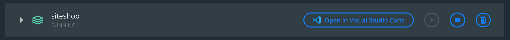
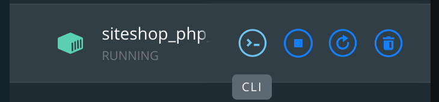
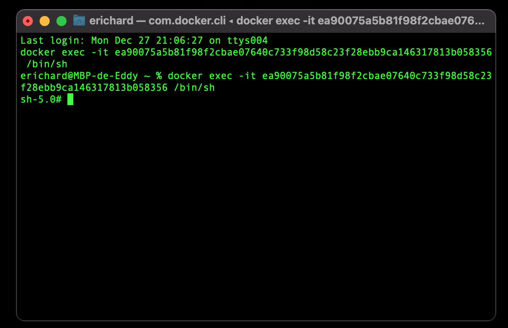
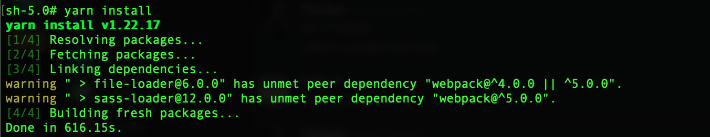
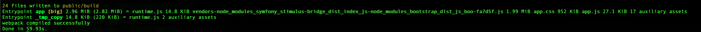

# e-commerce

### Récupérer le projer

```
$ git clone https://gitlab.com/edrichard/e-commerce.git
```

### Installation des containers 

```
$ docker network create proxy
$ docker-compose up -d
```

### Ajouter les `vhost`

- Linux / Mac OS X :
```
echo "127.0.0.1 site-shop.local phpmyadmin.site-shop.local mail.site-shop.local traefik.site-shop.local imaginary.site-shop.local" | sudo tee -a /etc/hosts
```

- Windows :

Ouvrir le fichier `host` qui se trouve dans le répertoire suivant : `c:\windows\system32\drivers\etc`. Pour l’ouvrir, il faut utilisez l’éditeur Bloc Notes de Windows en mode administrateur.
Ajouter les lignes suivantes à la suite du fichier :

```
127.0.0.1   site-shop.local 
127.0.0.1   phpmyadmin.site-shop.local 
127.0.0.1   mail.site-shop.local 
127.0.0.1   traefik.site-shop.local 
127.0.0.1   imaginary.site-shop.local
```

### Installation du projet

1. Via Docker Desktop :

- Ouvrir l'application ;
- Dans l'onglet `Containers / Apps` > `siteShop` (le nom du projet), cliquer dessus pour ouvrir le projet :
  
- Ouvrir le container `siteShop_php_1`, cliquer sur le bouton `CLI` pour ouvrir une console :
  
- Un Terminal s'ouvre :
  

2. Installation des assets PHP

```
$ composer install
```

3. Installation des assets JS 

```
$ yarn install
```


4. Compilation des assets JS 

```
$ yarn dev
```


4. Installation de la base de données 

Créer un fichier `.env.local`, ajouter les 4 variables suivantes :

- `APP_ENV` : mettre la valeur `dev`
- `DATABASE_URL` : renseigner l'url de connexion à la base de données `mysql://root:toor@db:3306/site-shop?serverVersion=5.7`
- `MAILER_DSN` : rensigner le DSN de connexion pour se connecter au SMTP de la boite au lettre `smtp://mailhog:1025` (mailHog)
- `ENDPOINT_IMAGINARY` : renseigner le point d'entrée de l'API Imaginary : `http://imaginary:9000/` [Repo Github](https://github.com/h2non/imaginary)

Monter la base de données :

```
$ php bin/console doctrine:migrations:migrate
```

Jouer les fixtures : 

```
$ php bin/console doctrine:fixtures:load
```

### Accéder aux différents containers

| Nom container (service) |    Port de connexion    | Url                                |
|:------------------------|:-----------------------:|:-----------------------------------|
| traefik                 | 80 (HTTP) / 443 (HTTPS) | http://traefik.site-shop.local/    |
| nginx                   |           80            | http://site-shop.local/            |
| php                     |          9000           | php:9000                           |
| db (MySQL)              |          3306           | mysql://root:toor@db:3306          |
| phpmyadmin              |           80            | http://phpmyadmin.site-shop.local/ |
| mailhog (SMTP)          |          1025           | smtp://mailhog:1025                |
| mailhog (HTTP)          |          8025           | http://mail.site-shop.local/       |
| imaginary               |          9000           | http://imaginary.site-shop.local/  |
